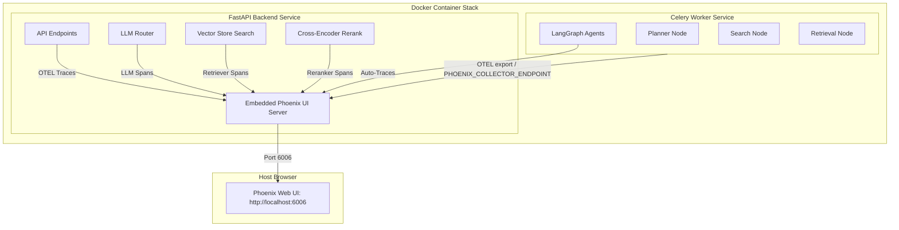

<!-- PHOENIX_OBSERVABILITY.md - Documentation for Phoenix observability setup. -->
# LLM & RAG Observability with Arize Phoenix

This document outlines the architecture, implementation steps, and usage guide for **Arize Phoenix** observability integrated into the AI Deep Research Agent platform.

---

## 1. Overview & Architecture

To achieve deep, production-grade visibility into our multi-agent research runs, LLM gateways, and RAG pipelines, we integrated **Arize Phoenix** as our core tracing and evaluation engine. 

### Observability Topology


1. **FastAPI Backend (`backend`)**: Launches the embedded Arize Phoenix server on startup, listening on port `6006`. It collects all local API and custom RAG/LLM gateway traces.
2. **Celery Worker (`worker`)**: Instead of launching a separate Phoenix UI, the worker is configured via `PHOENIX_COLLECTOR_ENDPOINT` to export all OpenTelemetry (OTEL) trace logs directly to the backend's Phoenix collector service (`http://backend:6006`).
3. **OpenTelemetry SDK**: Acts as the tracing backbone, enabling standard-compliant span collection across LLM calls, vector database queries, and agent nodes.

---

## 2. Implementation Steps & Code Modifications

### Step A: Dependency Setup
We added the necessary Arize Phoenix, OpenInference, and OpenTelemetry packages to the backend dependencies:
- **`backend/requirements.txt`**: Added `arize-phoenix`, `openinference-instrumentation-langchain`, `openinference-instrumentation-openai`, `opentelemetry-sdk`, and `opentelemetry-api`.

### Step B: Core Tracer Setup (`phoenix_tracer.py`)
Created [phoenix_tracer.py](file:///c:/Users/knare/OneDrive/Documents/timepass/backend/app/observability/phoenix_tracer.py) to manage the lifecycle of Phoenix and OpenTelemetry instrumentation:
* **Embedded UI Server Setup**: Launches the Phoenix app inside the FastAPI process using `px.launch_app(host=host, port=port)`.
* **Tracer Provider Registration**: Registers the global OTEL TracerProvider pointing to the local/external collector endpoint.
* **Auto-Instrumentation**: Leverages `LangChainInstrumentor` and `OpenAIInstrumentor` to capture standard LangChain/LangGraph executions and OpenAI API calls without manual wrappers.
* **Manual Span API (`phoenix_span`)**: Exposes a thread-safe context manager for custom span creations.

### Step C: LLM Gateway Instrumentation
Modified the central LLM Router to record metadata about every generated response:
* **[router.py](file:///c:/Users/knare/OneDrive/Documents/timepass/backend/app/llm/router.py)**: Intercepted LLM execution calls using `instrument_llm_call`.
* **[llm_instrumentation.py](file:///c:/Users/knare/OneDrive/Documents/timepass/backend/app/observability/llm_instrumentation.py)**: Captures model provider, latency (ms), token counts (prompt, completion), error status, and prompts previews.

### Step D: Custom RAG Pipeline Instrumentation
Since standard instrumentors do not capture our local RAG models, we wrapped them manually:
* **Vector Store (`vector_store.py`)**: Wrapped Qdrant query calls with `VectorRetrievalSpan`, recording search latencies, query text, collection name, and top hit scores.
* **Reranker (`reranker.py`)**: Instrumented the HuggingFace Cross-Encoder reranker using `RerankerSpan`, tracking incoming and outgoing chunk counts and model performance.
* **Additional Spans (`rag_instrumentation.py`)**: Defined standard wrappers for sentence embeddings, knowledge graph ingestion, and knowledge graph queries.

### Step E: Startup Initialization & Status Endpoint
Hooked the tracer into startup sequence:
* **`backend/app/main.py`**: Invokes `init_phoenix()` right after configuring logging to ensure all modules are monitored from their very first execution.
* **API Router (`router.py`)**: Added `/api/v1/observability/status` to expose the status of the tracer and the running Phoenix Web UI URL.

---

## 3. Environment Configurations

We added default configurations for Arize Phoenix across configuration files:

### `.env` and `.env.example`
```ini
# Arize Phoenix Observability
PHOENIX_ENABLED=true
PHOENIX_HOST=0.0.0.0
PHOENIX_PORT=6006
PHOENIX_PROJECT_NAME=deep-research-agent
# PHOENIX_COLLECTOR_ENDPOINT=
```

### Docker Compose (`docker-compose.yml`)
1. Exposed port `6006:6006` from the `backend` service container.
2. Set the `PHOENIX_COLLECTOR_ENDPOINT` environment variable in the `worker` service to `http://backend:6006` so the backend and background workers merge traces seamlessly.

---

## 4. Verification & Running Observability

### Start the Application Stack
Run the project via your Make script or Docker Compose:
```bash
docker-compose up --build
```

### Accessing the Observability Dashboard
Open your web browser and navigate to:
* **Phoenix UI**: `http://localhost:6006`
* **Observability API Route**: `http://localhost:8000/api/v1/observability/status`

### What to Look For
1. **Trace Trees**: Look for the parent execution span representing a search job (e.g., `agent.planner` or `agent.retrieval`).
2. **LLM Spans**: Click on LLM nodes to inspect exact prompts, token counts, temperature, and latency.
3. **RAG retrieval Spans**: Check the latency and result sizes of Qdrant and the BGA reranker.
